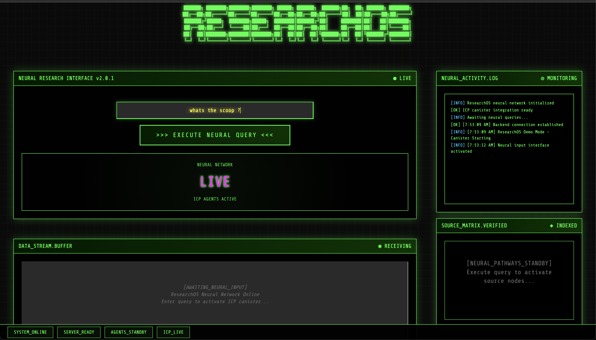

# ResearchOS

Autonomous AI agents on ICP that coordinate to maintain fresh, up-to-date knowledge bases - powered by blockchain-native timers and direct HTTP outcalls.



Built to demonstrate how ICP's unique features enable truly autonomous AI systems that would be impossible or prohibitively expensive on other blockchains.

## What It Does

ResearchOS is a **self-updating news intelligence system** where AI agents work together autonomously:

- **Ask for news** on any topic → Get AI-summarized results from Groq LLM
- **Enable tracking** → Topic auto-updates every 20 minutes forever  
- **Build knowledge over time** → Creates verifiable history of how news evolves
- **Runs autonomously** → No external triggers, servers, or maintenance needed

## Why This is Revolutionary on ICP

### 🚀 What Makes Our Agents Special

1. **Groq AI News Agent**
   - Makes HTTP outcalls directly from blockchain to AI APIs
   - No oracles needed (would cost $100s/day on Ethereum)
   - Stores AI responses immutably on-chain

2. **Timer Agent (The Game Changer)**
   - Runs every 20 minutes WITHOUT any external triggers
   - Completely autonomous - no Chainlink Keepers needed
   - Creates a truly unstoppable news aggregator

3. **Storage Agent**
   - 48GB of persistent memory (vs KB on Ethereum)
   - Maintains complete historical record
   - Data survives upgrades - true permanent storage

4. **Coordination Layer**
   - Agents share memory directly - no message passing
   - Zero coordination overhead
   - Seamless multi-agent collaboration

### 💰 Cost Comparison

| Platform | Daily Cost | Features |
|----------|------------|----------|
| ResearchOS on ICP | ~$0.01 | ✅ Autonomous timers<br>✅ Direct API calls<br>✅ Unlimited storage<br>✅ No gas per update |
| Ethereum + Chainlink | ~$500+ | ❌ Need oracles ($50/call)<br>❌ Need Keepers ($10/trigger)<br>❌ Storage extremely expensive<br>❌ Gas for every update |
| Traditional Server | ~$5-10 | ❌ Single point of failure<br>❌ Can be censored<br>❌ Requires maintenance<br>❌ Not verifiable |

## User Flow

```
1. User: "Tell me the scoop on Lagos tech scene"
   ↓
2. Groq AI Agent fetches & summarizes latest news
   ↓  
3. Storage Agent caches result with timestamp
   ↓
4. Timer Agent adds to 20-minute update cycle
   ↓
5. Forever: Autonomous updates without human intervention
   ↓
6. User can view history: See how news evolved over time
```

## ICP Superpowers Utilized

- **HTTP Outcalls**: Direct blockchain→AI communication (impossible on ETH/SOL)
- **Timers**: Self-executing code every 20 minutes (unique to ICP)
- **Stable Memory**: 48GB storage at ~$0.50/GB/year (vs $1M+/GB on Ethereum)
- **Low Cost**: Entire system runs for pennies per day

## Quick Demo

Run the complete development and user journey:

```bash
chmod +x demo_user_journey.sh
./demo_user_journey.sh
```

**What happens in the demo:**
- Deploys autonomous news network
- User searches for "Lagos news" → Gets AI summary
- Enables tracking → Automatic updates start
- Shows timer agent updating all topics
- Displays news history over time
- **Runtime**: 5-7 minutes

## Architecture

```
┌─────────────────────────────────────────────────────────────┐
│                    ResearchOS Canister                      │
├─────────────────────────────────────────────────────────────┤
│  News Agent: Queries Groq AI for summaries                 │
│  Timer Agent: Autonomous 20-min update cycles              │
│  Storage Agent: Maintains historical knowledge base         │
│  Tracking Agent: Manages monitored topics                  │
├─────────────────────────────────────────────────────────────┤
│  Cost: ~$0.01/day | Uptime: 100% | Censorship: Impossible │
└─────────────────────────────────────────────────────────────┘
```

## Local Development

### Prerequisites
- DFX SDK 0.15.0+
- Rust (latest stable)
- Node.js 16+ (for UI)

### Setup
```bash
git clone https://github.com/yourusername/researchos
cd researchos
dfx start --clean
./demo_user_journey.sh  # Compiles, deploys, and launches UI
```

### Core API
```bash
# Get news with tracking
dfx canister call research_ai_simple_backend get_news '(record {
  topic = "AI breakthroughs";
  enable_tracking = true
})'

# View all tracked topics
dfx canister call research_ai_simple_backend get_tracked_topics

# Check news history
dfx canister call research_ai_simple_backend get_news_history '("AI breakthroughs", opt 5)'

# Force immediate update
dfx canister call research_ai_simple_backend trigger_update_cycle
```

## Real-World Applications

### 📰 Decentralized News Aggregator
- Censorship-resistant news archive
- Verifiable update history
- No single point of failure

### 📈 Market Intelligence
```rust
track_topic("Bitcoin price analysis");
track_topic("S&P 500 market sentiment");
track_topic("Gold futures outlook");
// Updates every 20 minutes, forever
```

### 🔬 Research Assistant
- Track scientific breakthroughs
- Monitor paper publications
- Build citation networks over time

### 🏢 Competitive Intelligence
```rust
track_topic("OpenAI announcements");
track_topic("Google AI updates");
track_topic("Anthropic news");
// Autonomous competitor monitoring
```

## Why This Only Works on ICP

**Ethereum**: Would need Chainlink oracles (~$50/API call) + Keepers (~$10/update) = $1000s/day

**Solana**: No HTTP outcalls, no timers, would timeout on AI responses

**Traditional Backend**: Single point of failure, censorable, requires maintenance

**ICP**: Direct API calls + autonomous timers + cheap storage = $0.01/day

## Future Roadmap

- **Multi-LLM Integration**: Aggregate from GPT-4, Claude, Gemini
- **Smart Synthesis**: AI agents that cross-reference and validate
- **Specialized Verticals**: Financial research, academic papers, patent monitoring
- **Advanced UI**: Real-time dashboards and alerts

## The Vision

ResearchOS demonstrates a new paradigm: **Autonomous AI agents that maintain living knowledge bases on the blockchain**. 

No servers. No maintenance. No downtime. Just intelligent agents working 24/7 to keep information fresh and accessible.

## Hackathon Submission

**Innovation**: First truly autonomous AI-powered research system using ICP's unique features

**Technical Achievement**: Combined HTTP outcalls + timers + stable memory for unprecedented functionality

**Cost Efficiency**: Runs for ~$0.01/day vs $1000s on other platforms

**Canister ID**: [To be deployed]

**License**: Apache 2.0

---

ResearchOS: Where AI agents live on the blockchain and work for you forever.